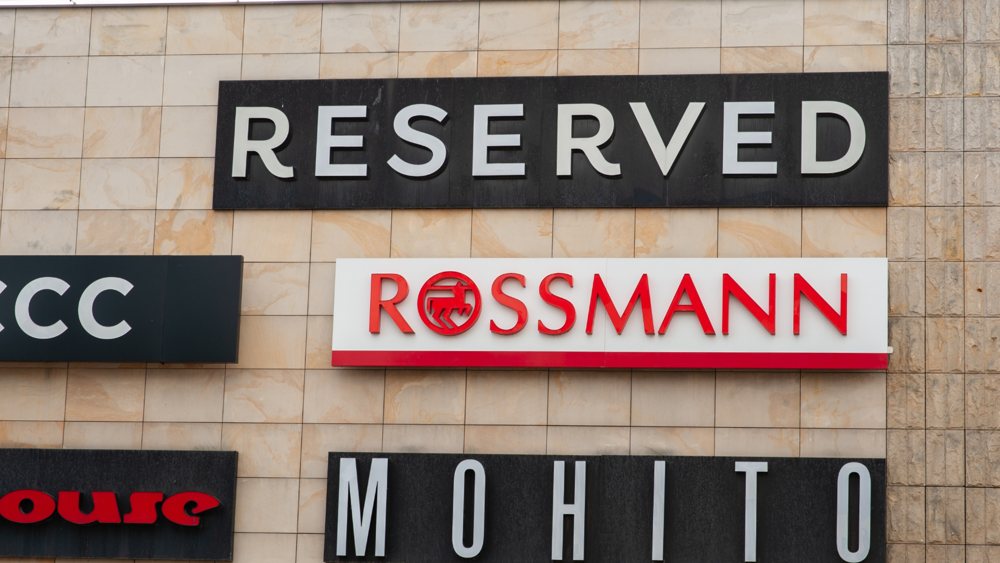

# ROSSMANN STORE SALES: Previsão de Vendas 📊✅

## Introdução

Este é um projeto de previsão de vendas para as lojas da Rossmann, que segue o método CRISP-DS (Cross Industry Standard Process for Data Mining). O CRISP-DS é um processo padrão da indústria para projetos de mineração de dados e ciência de dados, que envolve várias etapas desde a compreensão do problema de negócios até a implantação do modelo. Vamos explicar cada etapa até agora:

## 1. Questão de Negócio
Recebemos a demanda de todos os gerentes de lojas da Rossmann para fazer uma previsão de vendas dos próximos 6 meses para cada uma das lojas. Essa é a questão de negócio que estamos tentando resolver.

## 2. Entendimento do Negócio
Para entender melhor o motivo dessa demanda, conversamos com as partes interessadas e descobrimos que o problema fundamental é que o CFO da Rossmann precisa estimar o orçamento para reformas das lojas, e isso depende diretamente das vendas futuras de cada loja. Portanto, a precisão na previsão de vendas é crucial para o planejamento financeiro.

## 3. Coleta de Dados
Na vida real, a coleta de dados envolveria solicitações de API, consultas SQL e integração de várias fontes de dados. No entanto, para fins práticos, optamos por usar os dados disponíveis na plataforma Kaggle como fonte de dados para este projeto.

## 4. Limpeza dos Dados
A limpeza dos dados é uma etapa crítica para garantir a qualidade dos dados de entrada no modelo de previsão. Dividimos esse processo em três passos:
### Passo 1: Descrição dos Dados
Começamos com uma análise geral dos dados para entender o tamanho do problema.
### Passo 2: Feature Engineering
Realizamos a engenharia de recursos para derivar variáveis adicionais que poderiam ser úteis em nossa análise, como extrair informações de data e hora.
### Passo 3: Filtragem das Variáveis
Filtramos as variáveis com base nas restrições de negócios, removendo aquelas que não são relevantes para a previsão de vendas.

## 5. Exploração dos Dados
Nesta etapa, realizamos análises univariadas, bivariadas e multivariadas para descobrir correlações, validar hipóteses e gerar insights sobre os dados. Isso nos ajuda a entender melhor o comportamento das variáveis e sua relação com as vendas.

## 6. Modelagem dos Dados
A modelagem dos dados é uma fase crítica onde construímos o modelo de previsão. Ela se divide em dois passos:
### Passo 1: Preparação dos Dados
Neste passo, aplicamos técnicas de pré-processamento, como rescaling, encoding e transformações, para deixar os dados o mais próximo possível de uma distribuição normal e para transformar variáveis categóricas em numéricas.
### Passo 2: Filtragem das Variáveis Mais Relevantes
Aqui, removemos variáveis colineares, ou seja, variáveis que explicam a mesma parte do fenômeno, para evitar multicolinearidade e melhorar a interpretabilidade do modelo.

Agora, estamos prontos para avançar para as etapas seguintes do CRISP-DS, que envolvem a seleção de algoritmos de machine learning, avaliação do desempenho do modelo e, se necessário, repetição do ciclo para ajustar o modelo até que ele atenda às expectativas de acurácia. Por fim, quando estivermos satisfeitos com o modelo, faremos o deploy para utilização prática.